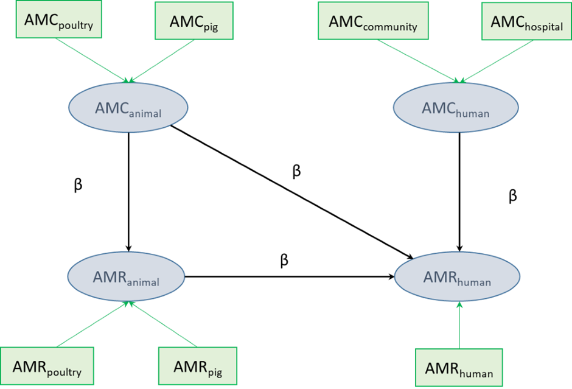

# PLS-PM Analysis Script

## Overview

This R script is designed to perform Partial Least Squares Path Modeling (PLS-PM) analysis using the "plspm" package in R. PLS-PM is a statistical technique used for structural equation modeling and modeling relationships between variables in multivariate data analysis.

The script includes different sections for data import, data preprocessing, and PLS-PM model estimation. It also demonstrates how to export the results to Excel files and create plots of the inner and outer structural models.

The analysis in this script includes three distinct models (complete, simplified and final), each representing a step in the backward manual stepwise regression process, where non-significant paths are discarded in the subsequent model.

## Methodology

The analysis investigates potential relationships between antimicrobial consumption (AMC) in humans, antimicrobial resistance (AMR) in bacteria from humans, AMC in food-producing animals (pigs and poultry), and AMR in bacteria from food-producing animals. Multivariate analyses were performed using PLS-PM. This methodology was chosen for its ability to explore multiple relationships between variable blocks through latent variables, without assuming data distributions.

| Outcomes              | Characteristics                                                                                                                                                                                                                                   |
|-------------|-----------------------------------------------------------|
| R2                    | Indicates the amount of variance in the dependent variable explained by the independent latent variables. Its value is usually considered high when it is greater than 0.50 or 0.60, depending on the authors.                                    |
| Path coefficients (β) | Usually placed next to the corresponding arrow, they are coefficients of the paths between latent variables, which vary between -1 and +1, and are standardized. The closer is the coefficient to the absolute value of 1, the stronger the path. |
| Direct effects        | Corresponds to the effect of one latent variable on another one directly.                                                                                                                                                                         |
| Indirect Effects      | Refers to the effect when a latent variable mediates an impact indirectly. For example, the indirect effect of AMC by food-producing animals on resistance in human isolates, mediated by resistance in food-producing animals.                   |

Non-significant relationships (p\>0.05) were systematically removed from the model in a stepwise backward process. The decision not to automate or generalize this step was made to ensure a comprehensive examination of all results, including loadings, weights, and other relevant outputs, before proceeding further. By carefully reviewing the outcomes of each step, you can make informed decisions regarding which variables and relationships to include in the final model. This allows for a deeper understanding of the data and results of the model's performance and helps ensure that the selected model aligns with the specific research objectives.

The PLS-PM analysis is performed using the "plspm" package developed by Gaston Sanchez. Please refer to the [PLS-PM package documentation](https://www.gastonsanchez.com/PLS_Path_Modeling_with_R.pdf) for detailed information on configuring the model.

### Full initial model

The full initial model computed is presented with related outcomes, according to the usual representation of PLS-PM. Indicators, also called 'manifest variables', are presented in green rectangles; they correspond to measured data on AMR and AMC. The variables displayed in blue ovals are 'latent variables', which were obtained from 'manifest variables'. Models were formative since latent constructs were formed by their indicators, as shown by arrows going from rectangles to ovals in the figure below.

**Figure 1**. Diagram showing the initial model considered to assess the potential relationships between resistance in bacteria from humans (AMRhuman) and antimicrobial consumption in humans (AMChuman), antimicrobial consumption in food-producing animals (AMCanimal) (whether as direct or indirect influential factor), and resistance in bacteria in food-producing animals (AMRanimal)

## Prerequisites

Before running the script, make sure you have the following:

-   R and R Studio installed on your system.
-   The required R packages installed. You can install them using the `install.packages()` function.

## Data

The multivariate analysis performed for JIACRA IV is based on data from 2020 and 2021, including AMR in pig and poultry isolates. For human data, 2020 and 2021 data were pooled for AMR, and AMC in humans was calculated as the average of the two years. In cases where hospital AMC data were missing, estimates were derived from other countries' data.

All data were standardized (mean = 0, variance = 1) before inclusion in the model.

The dataset provided for analysis contains synthetic data for E. coli and cephalosporins. It is intended for sharing purposes and serves as a starting point for your analysis. The structure of the dataset can be adapted to meet the specific needs of your analysis, keeping in mind that any changes to the dataset structure may require corresponding adjustments in the analysis code.

### Data Structure

The dataset structure should adhere to the following format, with one row per country and one column per item:

-   **ReportingCountry**: 2-letter ISO country code
-   **country_name**: Full country name
-   **AMC_pig**: Antimicrobial consumption in pigs in DDD/PCU (in 2021)
-   **AMC_poultry**: Antimicrobial consumption in poultry in DDD/PCU (equal to 0 for all countries for this specific class)
-   **AMCh_comm**: Antimicrobial consumption in humans in the community (as an average of 2020 and 2021 values)
-   **AMCh_hosp**: Antimicrobial consumption in humans in hospitals (as an average of 2020 and 2021 values)
-   **AMR_pig**: Antimicrobial resistance percentage in pigs (in 2021)
-   **AMR_poultry**: Antimicrobial resistance percentage in poultry (in 2020)
-   **AMRh**: Antimicrobial resistance percentage in animals (as a combination of all isolates tested from 2020 and 2021)

## Usage

1.  Open the showcasing script `PLSPM_ESCCOL_AMR_AMC_CEPH_2021.R`.

2.  Set the working directory to your desired location using `setwd()`.

3.  Install and load the necessary R packages, such as `readxl`, `plspm`, and `openxlsx`.

4.  Data Import:

    -   Read data from an Excel file using `read_excel()` from the "readxl" package.

5.  Data Pre-processing:

    -   Additional data pre-processing steps, such as removing countries with missing values.

6.  PLS-PM Model Estimation:

    -   Define the path model for latent variables and indicator definitions.
    -   Create the PLS-PM model using the `plspm` function and visualize the result using summary().
    -   Check which paths are significant in the model and re-run model maintaining only significant paths until reaching convergence.
    -   Optionally, export the results to Excel and inner and outer structural model plots as PDF files.

## Output

The script generates the following outputs:

-   Summary of PLS-PM results.
-   Optional excel files with different sheets containing PLS-PM results.
-   Optional PDF files with plots of the inner and outer structural models.

## Authors

This PLS-PM analysis script is the result of joint collaborative efforts between experts from the European Centre for Disease Prevention and Control (ECDC), the European Food Safety Authority (EFSA), and the European Medicines Agency (EMA). Liselotte Diaz Högberg, Joana Gomes Dias, Elias Iosifidis, Vivian Leung, Gaetano Marrone, Dominique Monnet, Cèlia Ventura-Gabarro, Vera Vlahović-Palčevski and Therese Westrell (ECDC); Marc Aerts, Pierre-Alexandre Belœil, Ernesto Liebana, Valentina Rizzi and Bernd-Alois Tenhagen (Chair) (EFSA), and Claire Chauvin, Barbara Freischem, Hector Gonzalez Dorta, Helen Jukes, Zoltan Kunsagi, Filipa Mendes Oliveira, Oskar Nilsson, Cristina Ribeiro-Silva, Chantal Quinten and Engeline van Duijkeren (EMA).

## Correspondence

For questions or assistance, you can contact: 
- ECDC: [arhai\@ecdc.europa.eu](mailto:arhai@ecdc.europa.eu) 
- EFSA: [zoonoses\@efsa.europa.eu](mailto:zoonoses@efsa.europa.eu) 
- EMA: <https://www.ema.europa.eu/en/about-us/contacts/send-question-european-medicines-agency>
