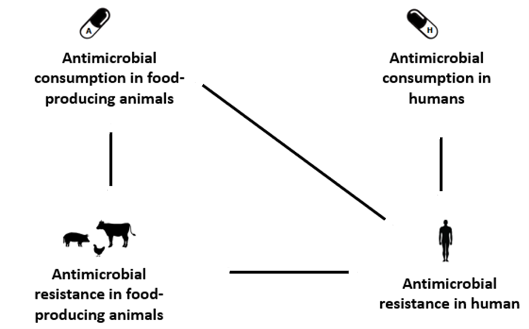
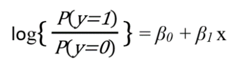
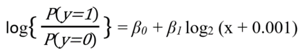
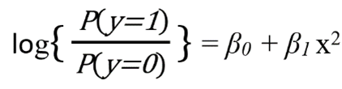

# Univariate Analysis Scripts

## Overview

Univariate logistic regression models are employed to evaluate statistically significant associations between four key variables: antimicrobial consumption in humans (AMCh), antimicrobial consumption in animals (AMCa), antimicrobial resistance in humans (AMRh) and antimicriobial resistance in food-producing animals (AMRa).

  

**Figure 1**. Schematic overview of the potential associations between antimicrobial consumption and antimicrobial resistance in humans and food-producing animals investigated in the univariate analysis.

## Methodology

Three logistic regression models are considered:

-   Model 1: Linear relationship between the predictor (x) and the logit of the probability of interest.

  

-   Model 2: Log-transformed predictor.

  

-   Model 3: Quadratic-transformed predictor.

  

These models capture different types of relationships and are expected to fit the datasets analyzed effectively.

### Interpretation of Odds Ratio (OR)

The odds ratio ($`\text{OR} = \exp(\beta_1)`$) represents the strength of the association between the predictor and the outcome. Interpretations differ among the models:

-   Model 1: Homogeneous effect, where the OR corresponds to a 1-unit increase in the predictor.

-   Model 2: Heterogeneous effect, the OR corresponds to a doubling of the predictor.

-   Model 3: Heterogeneous effect, the OR corresponds to an increase in the predictor to $\sqrt{x^2 + 1}$

### Model Selection

For each antimicrobial agent-bacteria combination, all three models are fitted, and the model with the lowest Akaike's Information Criterion (AIC) is chosen as the final model. Model selection is based on aggregated data, and the final model is fitted to individual years/periods. If a model needs to be forced in order to allow for comparison with previous years, the analysis_fun() allows to input the specific model to use.

### Parameter Estimation

Parameters and standard errors of the final logistic model are estimated using the method of Williams, accounting for overdispersion. Models are fitted only when five or more countries report information, and the total number of isolates tested within each country is 10 or more.

### Outliers Identification

Outliers are identified through a systematic sensitivity analysis, systematically omitting each observation (i.e. country) per year, rerunning the analysis, and examining the impact. If omission changes significance and has a relevant impact, results of the sensitivity analyses and on the observation values are reported to further assess its impact in the analysis.

## Data

The univariate analyses performed for JIACRA IV are based on antimicrobial consumption and resistance data from human and food-producing animals for the years 2019, 2020 and 2021 or periods corresponding to 2018-2019, 2019-2020 and 2020-2021.

The dataset provided for analysis contains country-anonymised synthetic data for all analyses reported in JIACRA IV. It is intended for sharing purposes and serves as a starting point for performing your own analyses. The structure of the dataset can be adapted to meet the specific needs of your analysis, keeping in mind that any changes to the dataset structure may require corresponding adjustments in the analysis code.

### Data Structure

Four individual datasets `AMCh`, `AMCa`, `AMRh` and `AMRa` are combined into four datasets (`AMCh_AMRh`, `AMCa_AMRh`, `AMRa_AMRh`, or `AMCa_AMRa`) to perform the different corresponding univariate analyses. In these datasets each row corresponds to a unique combination of country, year, pathogen, animal type, and antimicrobial class.

#### 1. AMCh_AMRh Dataset:

-   **ReportingCountry**: 2-letter ISO country code
-   **Year**: Numeric value indicating the year of observation
-   **Class**: Character string specifying the antimicrobial class (e.g., "AMP", 'CEPH', 'POL'...)
-   **Pathogen**: Character string specifying the pathogen (e.g., "ESCCOL", "SLMSPP", 'CAMCOL', 'CAMJEJ')
-   **DID_TOTAL**: Numeric value representing human antimicrobial consumption indicator in DDDs per 1000 inhabitants per days.
-   **Tested**: Numeric value representing the total number of isolates tested for antimicrobial resistance in humans (AMRh)
-   **NS**: Numeric value representing the number of non-susceptible isolates for AMRh
-   **PR_h**: Numeric value representing the probability of AMRh as a proportion of NS/Tested.
-   **pathogen_name**: Character string representing the full pathogen name (e.g., "Escherichia coli")
-   **class_name**: Character string representing the antimicrobial class name (e.g., "aminopenicillins")
-   **country_name**: Character string representing the full country name (e.g., "Austria")

#### 2. AMCa_AMRh Dataset:

-   **ReportingCountry**: 2-letter ISO country code
-   **Year**: Numeric value indicating the year of observation
-   **Class**: Character string specifying the antimicrobial class (e.g., "TET")
-   **Pathogen**: Character string specifying the pathogen (e.g., "CAMJEJ")
-   **PCU_ANIMALS**: Numeric value representing antimicrobial consumption in animals (AMCa) in mg/kg estimated biomass
-   **Tested**: Numeric value representing the total number of isolates tested for antimicrobial resistance in humans (AMRh)
-   **NS**: Numeric value representing the number of non-susceptible isolates for AMRh
-   **PR_h**: Numeric value representing the probability of AMRh as a proportion of NS/Tested.
-   **pathogen_name**: Character string representing the pathogen name (e.g., "Campylobacter jejuni")
-   **class_name**: Character string representing the antimicrobial class name (e.g., "tetracyclines")
-   **country_name**: Character string representing the full country name (e.g., "Austria")

#### 3. AMRa_AMRh Dataset:

-   **ReportingCountry**: 2-letter ISO country code
-   **Year**: Numeric value indicating the year of observation
-   **Class**: Character string specifying the antimicrobial class (e.g., "TET")
-   **Pathogen**: Character string specifying the pathogen (e.g., "CAMJEJ")
-   **Animal**: Character string specifying the animal type (e.g., "broilers")
-   **NS_a**: Numeric value representing the number of non-susceptible isolates for AMRa
-   **Tested_a**: Numeric value representing the total number of isolates tested for antimicrobial resistance in animals (AMRa)
-   **PR_a**: Numeric value representing the probability of AMRa as a proportion of NS_a/Tested_a.
-   **Tested**: Numeric value representing the total number of isolates tested for antimicrobial resistance in humans (AMRh)
-   **NS**: Numeric value representing the number of non-susceptible isolates for AMRh
-   **PR_h**: Numeric value representing the probability of AMRh as a proportion of NS/Tested.
-   **pathogen_name**: Character string representing the pathogen name (e.g., "Campylobacter jejuni")
-   **class_name**: Character string representing the antimicrobial class name (e.g., "tetracyclines")
-   **country_name**: Character string representing the full country name (e.g., "Austria")

#### 4. AMCa_AMRa Dataset:

-   **ReportingCountry**: 2-letter ISO country code
-   **Year**: Numeric value indicating the year of observation
-   **Class**: Character string specifying the antimicrobial class (e.g., "TET")
-   **Pathogen**: Character string specifying the pathogen (e.g., "ESCCOL")
-   **Animal**: Character string specifying the animal type (e.g., "animals")
-   **PCU_ANIMALS**: Numeric value representing antimicrobial consumption in animals (AMCa) in mg/kg estimated biomass
-   **NS_a**: Numeric value representing the number of non-susceptible isolates for AMRa
-   **Tested_a**: Numeric value representing the total number of isolates tested for AMRa
-   **PR_a**: Numeric value representing the probability of AMRa as a proportion of NS_a/Tested_a.
-   **pathogen_name**: Character string representing the pathogen name (e.g., "Escherichia coli")
-   **class_name**: Character string representing the antimicrobial class name (e.g., "tetracyclines")
-   **country_name**: Character string representing the full country name (e.g., "Austria")

## Scripts

In order to perform the univariate analyses several scripts containing customized functions are needed:

-   `config.R`. This script calls or the packages and other scripts containing the functions used during the univariate analysis.

-   `univariate_analysis.R`. This script contains the main function, `analysis_fun()`, to perform the univariate analysis.

-   `model_fun.R`. This script defines a function, `model_fun()`, to fit a regression model based on the specified `best_model` parameter.

-   `save_used_data.R`. This script defines a function, `saved_used_data()`, to save the data used in each analysis.

-   `univariate_plot.R`. This script defines a function, `univariate_plot()`, to create a scatter plot with data points and model trend lines for each unique year in the dataset

-   `outliers_assessment.R`. This script defines a function, `outliers_assessment()`, to assess the potential outliers in the chosen regression model.

## Usage

In order to effectively automatise the analyses done in JIACRA IV we have developed a series of functions that allow the user to perform all univariate analyses in a single R markdown file and export them into a word document.

1.  Install and load the necessary R packages found at `config.R`.

2.  Set the working directory to your desired location using `setwd()`. Please maintain the same folder structure used in this repository to ensure the correct functioning of the scripts.

3.  Open the R markdown file report_univariate_complete.Rmd.

    -   Import the datasets with their corresponding structure.
    -   Select the parameters to perform the desired analyses.
    -   Run the analyses individually at the .Rmd or export a word document containing the results of all the analyses clicking on 'Knit'.

## Outputs

Results of the final selected models are summarized in tables, indicating the countries included, the chosen model, and point and interval estimates. Graphs visualize the data alongside the fitted curve of the final model. A detailed summary of the potential outliers is produced.

In JIACRA IV report graphs are included only for statistically significant associations. The size of bubbles in the graphs represents the number of tests involved, offering a visual representation of differences between countries.

## Authors

The univariate analysis scripts are the result of joint collaborative efforts between experts from the European Centre for Disease Prevention and Control (ECDC), the European Food Safety Authority (EFSA), and the European Medicines Agency (EMA). Liselotte Diaz Högberg, Joana Gomes Dias, Elias Iosifidis, Vivian Leung, Gaetano Marrone, Dominique Monnet, Cèlia Ventura-Gabarro, Vera Vlahović-Palčevski and Therese Westrell (ECDC); Marc Aerts, Pierre-Alexandre Belœil, Ernesto Liebana, Valentina Rizzi and Bernd-Alois Tenhagen (Chair) (EFSA), and Claire Chauvin, Barbara Freischem, Hector Gonzalez Dorta, Helen Jukes, Zoltan Kunsagi, Filipa Mendes Oliveira, Oskar Nilsson, Cristina Ribeiro-Silva, Chantal Quinten and Engeline van Duijkeren (EMA).

## Correspondence

For questions or assistance, you can contact:

-   ECDC: [arhai\@ecdc.europa.eu](mailto:arhai@ecdc.europa.eu)
-   EFSA: [zoonoses\@efsa.europa.eu](mailto:zoonoses@efsa.europa.eu)
-   EMA: <https://www.ema.europa.eu/en/about-us/contacts/send-question-european-medicines-agency>
